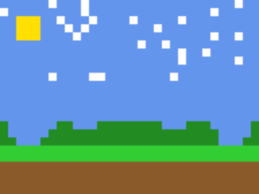
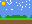
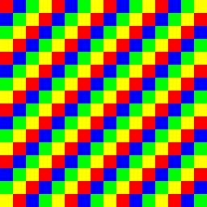
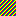

# Arcadia

Convert AI-generated "pixel art" images into true pixel art SVGs.

AI tools like Nano Banana 2 produce images that *look* like pixel art but are actually high-resolution with anti-aliasing, gradients, and sub-pixel detail. Arcadia detects the implied pixel grid, quantizes colors, and outputs a clean SVG where each logical pixel is a single `<rect>` — scalable to any size with crisp edges.

## Install

Requires Python 3.10+ and conda.

```bash
conda create -n arcadia python=3.12
conda activate arcadia
pip install -e .
```

## Usage

```bash
arcadia input.png                    # → input.svg
arcadia input.png -o output.svg      # custom output path
arcadia input.png -v                 # verbose (grid size, palette count, timing)
```

## Examples

Generate sample images:

```bash
python examples/generate_samples.py
```

Then convert them:

```bash
arcadia examples/character_16x16_aa.png -v
# Grid detected: 16x16 (cell_size=16px, confidence=1.00) [0.00s]
# Grid aligned: local boundaries snapped [0.00s]
# Palette: 7 colors [0.00s]
# Total: 0.01s

arcadia examples/landscape_64x48_aa.png -v
# Grid detected: 64x48 (cell_size=16px, confidence=0.80) [0.02s]
# Grid aligned: local boundaries snapped [0.00s]
# Palette: 6 colors [0.04s]
# Total: 0.06s
```

### Character Sprite

| Input PNG (with anti-aliasing) | Output SVG (true pixel art) |
|---|---|
|  |  |

16x16 grid, 7 colors, converted in 0.01s

### Landscape

| Input PNG (with anti-aliasing) | Output SVG (true pixel art) |
|---|---|
|  |  |

32x24 grid, 6 colors, converted in 0.02s

### Checkerboard

| Input PNG | Output SVG |
|---|---|
|  |  |

16x16 grid, 4 colors

## How It Works

1. **Grid detection** — autocorrelation of the gradient signal finds the cell size (the pixel grid period)
2. **Local alignment** — snaps cell boundaries to actual color transition edges, handling AI images where the grid drifts locally by 1-2px
3. **Color quantization** — extracts the dominant color per cell (median of center region), then merges near-duplicate colors via centroid-based clustering
4. **SVG rendering** — outputs one `<rect>` per logical pixel with `shape-rendering="crispEdges"`

## Architecture

```
arcadia/
  cli.py         — CLI entry point (argparse), image loading, RGBA→RGB
  grid.py        — Grid detection via gradient autocorrelation
  alignment.py   — Local grid alignment (snap boundaries to edges)
  palette.py     — Per-cell color extraction + palette merging
  svg.py         — SVG generation (one rect per pixel, crispEdges)
  pipeline.py    — Orchestrates the full conversion pipeline
```

## Tests

```bash
conda activate arcadia
python -m pytest tests/ -v
```

## Future

- Layered SVG output (`<g>` groups)
- Sprite animations (wind, rain, leaves)
- Batch processing (folder of images)
- CIELAB Delta-E for perceptually accurate color merging

## License

MIT
